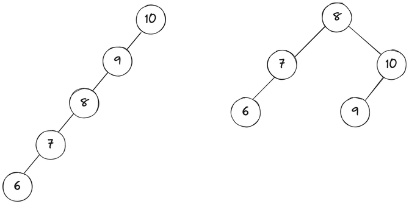

# rbtree-lab

## 1. 레드 블랙 트리란?
다음과 같은 성질을 만족하는 이진 검색 트리이다.

1. 모든 노드는 레드 또는 블랙이다.
2. 루트 노드는 블랙이다.
3. 리프 노드는 블랙이다.
4. 레드 노드의 자식은 모두 블랙이다.
5. 한 노드로부터 그 자손인 리프 노드로까지 가는 경로에 포함된 블랙 노드의 개수가 모두 같다.

5번 규칙 중 ‘한 노드로부터 그 자손인 리프 노드로까지 가는 경로에 포함된 블랙 노드의 수’를 일컬어 흑색 높이, Black Height이라고 한다. 이는 레드 블랙 트리를 균형 이진 트리 Balanced Binary Tree로 만드는 중요한 특성 중 하나다. 레드 노드의 자식은 블랙이어야 하므로, 한 노드에서 리프까지로의 경로는 다른 노드의 경로에 비해 최대 2배까지만 길어질 수 있게 된다. (`블랙 - 블랙 - 블랙` 인 경우와 `레드 - 블랙 - 레드 - 블랙 - 레드 - 블랙`인 경우를 생각해 보자.)

## 2. Balanced Binary Search Tree

### 이진 탐색 트리에서 균형은 왜 중요한가요?

균형 잡히지 않은 이진 검색 트리의 경우, 탐색 시간이 최대 $O(n)$까지 나타난다. 위와 같은 경우를 생각해 보자. 왼쪽 트리의 경우 키 6을 찾기 위해 5번의 탐색 연산이 필요하다. 리스트의 선형 탐색과 다르지 않다. 트리에 원소가 삽입되는 순서에 따라 탐색에 소요되는 시간복잡도가 결정되는 것이다. 따라서, **트리의 높이를 항상 최솟값, 즉 $\log n$으로 줄이는 것**이 중요해진다. 이를 위해 트리의 균형을 유지하는 방식으로 삽입 또는 삭제 연산을 수행하는 Balanced Binary Search Tree가 사용된다.

**[🍀 Wikipedia — Self Balancing Binary Search Tree](https://en.wikipedia.org/wiki/Self-balancing_binary_search_tree)**

> 컴퓨터 과학 분야에서, **self-balancing binary search tree (BST)**는 임의의 원소 삽입 및 삭제에 대해 트리의 높이 (루트 아래 레벨의 최댓값)을 자동으로 최소로 유지하는 node-based 이진 탐색 트리를 말합니다. 자체 균형 이진 탐색 트리를 위해 설계된 삽입, 삭제 연산에는 트리 높이가 무한히 증가하는 것에 대한 예방 precaution이 포함되어 있기 때문에, 추상 자료형에는 ‘self-balancing’이라는 속성이 포함됩니다.

**높이-균형 이진 트리** height-balanced binary tree에 대해, 높이는 대수적으로 $n$개의 원소에 대해 $O(\log n)$ 으로 정의됩니다. AVL 트리, Red-Black Tree와 같은 많은 이진 탐색 트리가 이 경우에 포함됩니다. Splay Tree 와 treaps는 자체-균형이지만 높이-균형으로 볼 수 없는데, 이들의 높이가 원소의 개수에 대해 대수적으로 보장되지 않기 때문입니다.

자체-균형 이진 트리는 mutual ordered list를 위한 효과적인 구현이 될 수 있으며, associative arrays, priority queues, 및 sets와 같은 추상 자료형에 사용될 수 있습니다.
> 

### 2.1. 균형 이진 검색 트리에는 무엇이 있나요?

- **2-3 Tree** : 모든 내부 노드가 하나의 데이터 원소와 두 자식 노드를 갖거나, 두 개의 데이터 원소와 세 개의 자식 노드를 갖는 트리 데이터 구조이다.
- **AVL Tree** : 모든 노드에서 오른쪽 서브트리와 왼쪽 서브트리의 높이 차가 최대 1인 self-balancing BST이다.
- **Red-Black Tree** : Red-Black 5개 속성을 유지하는 방식으로 각 노드 간 높이 차가 최대 2배까지만 나타날 수 있도록 제한하는 self-balancing BST이다.
- **B-Tree** : 

균형의 엄격함만 보면 AVL트리가 가장 효율적일 것 같지만, 다른 트리 자료구조가 만들어지고 발전된 것은 균형만이 효율성을 구성하는 요소는 아니기 때문이다. 트리를 자체 밸런싱하는 데 드는 회전 rotation 연산 역시 고려되어야 한다. AVL 트리는 매 삽입, 삭제 연산마다 트리의 균형을 복원하는 추가적인 회전 연산이 필요하다. 삽입, 삭제 연산의 패턴에 따라 이는 오버헤드로 작용할 수 있다. 따라서 느슨한 균형 조건을 적용하는 Red-Black 트리나 AA트리가 더 효과적일 수 있다.

### 2.2. 어디에 사용되나요?

자체 균형 이진 탐색 트리는 우선순위 큐와 같은 ordered list를 구현하는 데 사용될 수 있다. 또한 해시 테이블과 함께 연관 배열 associative array를 구현하는 두 가지 대표적인 방법이기도 하다.

**[+ 연관 배열에 대해 Pintos hash table에서 정리했던 내용 연결]**

- **associative array (연관 배열)**: CS분야에서 associative array, map, symbol table, 또는 dictionary는 각 키가 해당 집합에서 최소 한 번 이상 등장하는, 여러 개의 키-값 쌍의 집합으로 이루어진 추상 자료형이다. 수학적 용어에서 associative array란 유한한 정의역을 가진 함수이다. 일반적으로 lookup, remove, insert 연산을 지원한다.
- **dictionary problem**: associative array를 구현하는 효율적인 자료구조를 설계하는 고전적인 문제이다. 이 문제의 해답으로 제시된 것 중 주요한 두 가지가 바로 hash table과 search tree이다.
- **hash table**: 해시 테이블은 연관 배열을 구현하기 위해 hash function을 사용해 인덱스를 계산하고, 값을 해당 인덱스의 버킷(또는 슬롯)에 저장한다. 저장된 값을 찾기 위해서는 다시 hash function을 사용해서 인덱스에 접근한다. 이상적으로는, 하나의 키가 하나의 값으로 매핑되어야 하기에 각 버킷에 저장되는 값은 하나여야 한다. 그러기 위해서, 모든 키에 대해 해시 함수의 리턴값이 유니크해야 한다. 하지만 대부분의 해시 테이블 디자인은 완벽하지 않은 해시 함수를 사용하기에, 둘 이상의 키에 대해 같은 index를 생성하는 hash collision이 발생할 수 있다.

